# mando_localization

`mando_localization`은 ROS1 Noetic 차량에서 IMU·엔코더의 연속 움직임과 GPS·2D LiDAR의 절대 위치를 두 단계 EKF로 결합하는 패키지입니다. 상태 판단과 최종 위치 출력을 분리하고, 입력이 오래되거나 계약을 위반하면 공개 Odometry를 차단하는 fail-closed 구조입니다.



토픽·메시지 타입과 알고리즘 임곗값까지 포함한 상세 버전입니다.



장기 GPS 단절 복구만 분리한 그림은
[간단 Flow](docs/images/relocalization_manager_flow.svg)와
[상세 아키텍처](docs/images/relocalization_manager_architecture.svg)로 제공하며,
편집 원본은 각각 [`간단 Mermaid`](docs/relocalization_manager_flow.mmd)와
[`상세 Mermaid`](docs/relocalization_manager_architecture.mmd)입니다.

## 실제 데이터 흐름

- `LocalizationInterfaceAdapter`가 변경 가능한 공개 토픽과 드라이버·EKF의 고정 내부 토픽 사이를 단순 relay합니다. 위치 계산이나 품질 판단은 하지 않습니다.
- Local EKF는 정규화된 IMU의 yaw/yaw rate와 엔코더 `Twist.linear.x`를 융합하고 `odom -> base_link`를 발행합니다.
- GPS 게이트는 `NavSatFix`를 datum 주변 WGS84 local tangent 좌표로 직접 투영합니다. Local Odometry로 예측한 위치와 거리·Mahalanobis innovation을 검사하며, 승인 전 quality candidate를 장기 단절 복구용 내부 토픽으로 분리합니다. `navsat_transform_node`는 사용하지 않습니다.
- LiDAR 게이트는 원시 LaserScan을 검사해 AMCL 전용 내부 토픽으로 relay하고, AMCL pose의 시간·공분산·점프·연속 안정성을 검사합니다. AMCL은 `tf_broadcast: false`입니다.
- Global EKF는 Local EKF와 같은 IMU·Twist를 예측 입력으로 다시 사용하고, 승인된 GPS/LiDAR pose를 절대 위치 입력으로 융합합니다. Local Odometry 자체는 중복 융합하지 않습니다.
- `LocalizationSupervisor` 프로세스 안에서 `LocalizationStatusManager`는 센서 상태만 평가하고 `RelocalizationCoordinator`는 장기 GPS 단절을 조정합니다. 장기 복구 pose는 transaction이 포함된 reanchor 명령을 GPS gate가 실제 적용하고 ack한 뒤에만 공개됩니다. Supervisor가 공개 상태·유효성의 단일 소유자이며, 별도 `LocalizationOutputGate`는 상태 승인과 Global Odometry 안전 검사를 모두 통과한 메시지만 공개합니다.
- 시각화 노드는 승인된 위치로 Path와 차량·GPS·LiDAR MarkerArray를 만들고, RViz 한 창에 지도·TF·LaserScan·위치·공분산·경로·한국어 상태 패널을 표시합니다.

자세한 내용은 [문서 목차](docs/README.md), [아키텍처](docs/architecture.md),
[GPS 품질·재연결](docs/gps_quality_and_recovery.md),
[설정 가이드](docs/configuration.md)를 참고하십시오.

## 공개 ROS 인터페이스

| 용도 | 기본 토픽 | 메시지 |
|---|---|---|
| Arduino 피드백 | `/erp42_serial/feedback` | `erp42_msgs/SerialFeedBack` |
| 차량 속도 | `/molit/vehicle/twist` | `geometry_msgs/TwistWithCovarianceStamped` |
| IMU 원본 / 정규화 | `/molit/sensors/imu/data`, `/molit/localization/imu/normalized` | `sensor_msgs/Imu` |
| GPS 원본 | `/molit/sensors/gps/fix` | `sensor_msgs/NavSatFix` |
| GPS 상세 상태 | `/molit/sensors/gps/navpvt` | 드라이버의 NavPVT 타입을 그대로 relay |
| 원시 LaserScan | `/molit/sensors/lidar/scan` | `sensor_msgs/LaserScan` |
| Local / Global EKF | `/molit/localization/local/odometry`, `/molit/localization/global/odometry` | `nav_msgs/Odometry` |
| GPS / LiDAR 승인 위치 | `/molit/localization/gps/map_pose`, `/molit/localization/lidar/map_pose` | `geometry_msgs/PoseWithCovarianceStamped` |
| 최종 위치 | `/molit/localization/odometry` | `nav_msgs/Odometry` |
| 경로 / 마커 | `/molit/localization/path`, `/molit/localization/markers` | `nav_msgs/Path`, `visualization_msgs/MarkerArray` |
| 상태 / enum / 유효성 | `/molit/localization/status`, `/molit/localization/state`, `/molit/localization/valid` | `DiagnosticArray`, `String`, `Bool` |
| 장기 복구 단계 | `/molit/localization/recovery/state` | `std_msgs/String` |
| 지도 / AMCL 초기값 | `/map`, `/initialpose` | `nav_msgs/OccupancyGrid`, `PoseWithCovarianceStamped` |

`/molit/localization/gps/map_pose`의 단일 발행자는
`RelocalizationCoordinator`입니다. GPS gate의 정상 승인 결과와 장기 복구
quality candidate는 서로 다른 내부 토픽으로만 Coordinator에 전달되며 Global
EKF를 직접 우회하지 않습니다.

### Arduino 엔코더 연결 계약

Arduino가 발행하는 `/erp42_serial/feedback`을 localization이 직접 구독합니다.
`SerialFeedBack`에는 ROS `Header`가 없으므로 `EncoderToTwistAdapter`가 받은 PC 시각을 출력 timestamp로 사용합니다.

| 입력 필드 | 타입 | localization 사용 방식 |
|---|---|---|
| `MorA`, `EStop`, `Gear` | `uint8` | 수신은 하지만 현재 EKF 관측에는 사용하지 않음 |
| `speed` | `float64`, m/s | `vx = speed × 1.0 × 1`; Local/Global EKF의 전진 속도 |
| `steer` | `float64`, ADC | finite·범위 검사와 진단만 수행; yaw 계산에는 사용하지 않음 |
| `brake` | `int16` | 상태 진단만 수행 |
| `encoder` | `int32`, 최근 0.10 s delta | 범위 검사와 선택적 속도 일관성 검사; 현재 meter-per-tick 비활성 |
| `alive` | `uint8` | 직전 값과 같으면 중복/정지로 거부; `255 → 0` 변경 허용 |

통과한 입력은 `/molit/vehicle/twist`의 `TwistWithCovarianceStamped`로 변환됩니다. 현재 `linear.x`만 관측하며 `Var(vx)=0.25 (m/s)^2`입니다. 정확한 기본값은 [`config/encoder_calibration.yaml`](config/encoder_calibration.yaml)이 기준입니다.

드라이버, `robot_localization`, AMCL 내부 토픽은 충돌과 설정 중복을 막기 위해 `/mando_localization/internal/...`로 고정되어 있습니다. 어댑터는 GPS NavPVT, map과 initialpose도 relay하므로 공개 이름은 `config/localization_interfaces.yaml`에서 관리합니다. 다만 RViz display 토픽은 `.rviz` 파일에도 저장되므로 토픽을 바꿀 때 차량별 `rviz_config`도 함께 준비해야 합니다.

## 빌드와 기본 실행

```bash
cd /home/stier/Mando_1-5/localization
source /opt/ros/noetic/setup.bash
catkin_make
source devel/setup.bash
roslaunch mando_localization bringup.launch
```

기본값은 `start_imu_driver:=false`, `start_gps_driver:=false`,
`enable_lidar_localization:=false`이며 GPS-only automatic reset도 비활성입니다.
외부에서 공개 센서 토픽을 발행하지 않으면 상태는 유효해지지 않고 최종
Odometry도 나오지 않습니다. Local drift가 누적된 장기 GPS 단절에서는 기본
설정이 자동 위치 점프를 하지 않고 `RELOCALIZING`, `valid=false`를 유지합니다.
헤드리스 환경에서는 `start_rviz:=false`를 추가합니다.

패키지 드라이버를 사용할 때는 장치 별칭과 드라이버 설치를 먼저 확인합니다.

```bash
test -e /dev/imu && readlink -f /dev/imu
test -e /dev/mando_gps && readlink -f /dev/mando_gps
rospack find xsens_mti_driver
rospack find ublox_gps

roslaunch mando_localization bringup.launch \
  start_imu_driver:=true \
  start_gps_driver:=true
```

> 2026-08-31 재확인 결과 이 작업 환경에서는 `xsens_mti_driver`는 발견되지만
> `ublox_gps`, `nmea_navsat_driver`, `/dev/imu`, `/dev/mando_gps` 별칭은
> 없습니다. 실제 장치는 `/dev/ttyUSB0`(IMU, `DB8GG04M`)과
> `/dev/ttyUSB1`(GPS, `DBT042C1`)로 연결돼 있지만, 별칭이 없는 상태에서 기본
> driver config를 사용하면 포트를 열 수 없습니다. 먼저
> `rosdep install --from-paths src --ignore-src -r -y`를 시도하되 `ublox_gps`
> key가 해석되지 않으면 검증된 ROS1 driver를 별도 설치해야 합니다. 그 뒤
> [udev 설치 절차](udev/README.md)를 적용하고 `rospack find`와 장치 별칭을
> 다시 확인합니다.

LiDAR 위치추정은 실제 지도와 외부 파라미터가 준비된 뒤 명시적으로 켭니다.

```bash
roslaunch mando_localization bringup.launch \
  enable_lidar_localization:=true \
  map_file:=/absolute/path/to/map.yaml
```

이미 다른 launch가 위치 토픽을 발행 중이고 시각화만 별도로 시작하려면 다음을 사용합니다. RViz 플러그인이 전역 YAML namespace를 필요로 하므로 `rviz -d`를 직접 실행하는 것보다 이 launch를 사용해야 합니다.

```bash
roslaunch mando_localization visualization.launch
```

## 운영 전 필수 실측

현재 기본 설정은 안전한 자리표시자입니다.

- `maps/map.yaml`은 없고 구조 설명용 `map.yaml.example`만 있습니다.
- `base_link` 원점은 뒷바퀴 축 중심입니다. IMU X=+0.25 m, LiDAR X=+1.05 m는 기록했지만 Y/Z/RPY가 미측정이므로 센서 TF는 모두 `unmeasured`, `enabled: false`라 발행되지 않습니다.
- GPS 기준은 지도 없는 개발용 `first_fix`, `measured: false`입니다. 실지도에서는 측량한 `manual_datum`, map 좌표와 yaw를 입력해야 합니다.
- 엔코더 meter-per-tick과 조향 ADC는 미측정이며 Arduino `SerialFeedBack.speed`만 융합합니다.
- IMU covariance override에는 2026-08-31 정지·모터 OFF bag의 noise floor가 `measured`로 입력돼 있지만 주행·진동·절대 yaw 오차까지 검증한 값은 아닙니다. GPS는 단독 GNSS 설정이며 NTRIP/RTCM 입력은 이 범위에 포함되지 않습니다.

실측값 없이 기능을 강제로 켜면 노드가 실행되더라도 지도 기준 위치의 정확성을 보장할 수 없습니다.

### 현재 Xsens 확인 결과와 남은 차단 조건

2026-08-30 실장치 확인에서 Xsens 드라이버 auto-scan은 `/dev/ttyUSB0`, serial `DB8GG04M`, device ID `03889250` (`MTi-3-8A7G6`), 115200 baud를 찾았습니다. `sensor_msgs/Imu`는 약 100.95 Hz, `frame_id=imu_link`, 0이 아닌 timestamp로 수신됐습니다.

하지만 orientation, angular velocity, linear acceleration covariance 세 배열은 모두 0이었습니다. 2026-08-31 정지·모터 OFF 10분 bag의 첫 60초를 제외한 표준편차를 `covariance_override`에 `measured` 상태로 기록해 현재는 정규화 토픽에 양의 대각 covariance를 생성합니다. 이 값은 정지 noise floor일 뿐 모터·진동·자기장 교란과 절대 yaw 오차를 포함하지 않으므로 운영용 `verified` covariance가 아닙니다. 실제 주행 전 모터 ON, 방향 기준과 주행 residual 시험으로 교체해야 합니다.

### 현재 GPS 확인 결과와 남은 차단 조건

같은 날 `/dev/ttyUSB1`, serial `DBT042C1`, 460800 baud에서 NMEA `GNRMC`·`GNGGA` 문장을 확인했지만 상태는 각각 invalid (`V`)·no-fix (`0`)였습니다. `gps_driver.yaml`은 드라이버 시작 시 UART1 RAM 설정을 UBX 입력/출력으로 바꾸도록 `config_on_startup: true`이며, Flash에는 저장하지 않습니다. `fix_mode: both`, `NavPVT: true`, `RELPOSNED: false`가 현재 계약입니다.

현재 호스트에는 `ublox_gps`가 없으므로 이 전환과 ROS `NavSatFix`/`NavPVT` 토픽은 아직 실장치에서 검증되지 않았습니다. 패키지를 설치한 뒤 실외 fix, rate, timestamp, `gps_link`, covariance를 다시 확인해야 합니다.

`NavSatFix.status=-1`은 no-fix로 거부합니다. `0/1/2`는 각각 일반 FIX,
SBAS, GBAS 종류이며 현재 `minimum_fix_status=0`에서는 모두 같은 추가
frame·timestamp·covariance·innovation 검사를 받습니다. 숫자만으로 실제 위치
정확도를 정할 수 없습니다. `position_covariance`는 원칙적으로 GPS 드라이버가
제공하며 gate가 자체 추정하지 않습니다. covariance type이 `UNKNOWN`이면 수평
`25 m²`, 수직 `100 m²` fallback을 사용하지만 이는 실측 정확도가 아닙니다.
자세한 판정은 [GPS 품질·재연결 문서](docs/gps_quality_and_recovery.md)에 정리했습니다.

### 2026-08-31 복구 경계 검증 스냅샷

- 전체 Catkin 테스트: `100 tests, 0 errors, 0 failures`
- Local Odometry가 20 m 벗어난 상태에서 GPS가 거부되고, 실제 reanchor 적용과
  정확한 ACK 뒤 다시 통과하는 경로 확인
- LiDAR 불일치, ACK 이전 공개 차단, 잘못되거나 늦은 ACK 거부 확인
- GPS-only reset에서 정지 후보, post-reset Global 결과 3회와 gate ACK 순서 확인

이 결과는 합성·노드 통합 계약 검증이며 실제 GNSS fix, LiDAR 지도 정합과
closed-loop 차량 복구 성능을 증명하지 않습니다.

## 문서 그림 갱신과 검증

```bash
cd /home/stier/Mando_1-5/localization/src/mando_localization
./scripts/render_architecture.sh

cd /home/stier/Mando_1-5/localization
source /opt/ros/noetic/setup.bash
catkin_make run_tests
catkin_test_results --verbose
```

Mermaid 렌더 스크립트는 `@mermaid-js/mermaid-cli@11.16.0`으로 SVG와 PNG를 함께 만들고 필수 노드, 파일 형식과 빈 결과를 검사합니다. 단위 테스트 통과는 실차 timestamp, 센서 주기·공분산, USB 재연결, datum·지도 정합과 외부 파라미터 정확도를 대신하지 않습니다.
