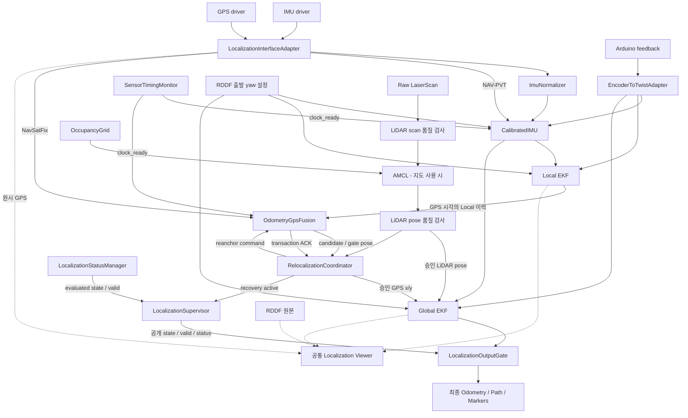

# 현재 Localization 아키텍처

ROS1 Noetic의 Local/Global 두 EKF, GPS·LiDAR 품질 게이트,
상태 감독과 최종 출력 게이트로 구성합니다. `localization`과
`replay.launch`는 지도 없이 GPS를 사용하는 경로이며, AMCL은 실제 지도와 datum을
준비한 뒤 별도로 활성화하는 기능입니다.

## 데이터 흐름

그림의 EKF 입출력은 InterfaceAdapter를 통해 공개 토픽과 고정 내부 토픽으로
연결됩니다. Adapter는 위치 계산·품질 판단을 하지 않습니다.
`OdometryLidarFusion` 한 구성요소가 scan 및 AMCL pose 검사를 담당합니다.
StatusManager는 보정 IMU·Twist·Local/Global·절대 위치와 게이트 상태를 관찰합니다.

## 책임과 실행 단위

| 실행 파일 | 책임 |
|---|---|
| `localization_interface_adapter_node` | 드라이버·EKF 내부 토픽과 공개 토픽 relay |
| `encoder_to_twist_adapter_node`, `imu_normalizer_node` | 엔코더 메시지 검증·속도 변환, IMU 형식·공분산 정규화 |
| `calibrated_imu_node.py` | RDDF 출발 yaw 초기화, 엔코더 0일 때 yaw·차량 Z 각속도 정지 제약, GNSS 직진 offset 정합 |
| `ekf_localization_node` 두 프로세스 | Local 연속 운동 추정, Global 절대 위치 융합 |
| `odometry_gps_fusion_node` | GPS 시각 정합, 좌표 투영·평면 레버암·innovation gate |
| `odometry_lidar_fusion_node` | 지도 사용 시 scan 및 AMCL pose 품질 검사 |
| `localization_supervisor_node` | StatusManager·Coordinator·Supervisor를 한 프로세스에서 실행 |
| `localization_output_gate_node` | 상태 승인과 Global 메시지 계약을 모두 통과한 최종 Odometry만 발행 |
| `static_transform_publisher_node` | 검증된 장착 TF 발행 |
| `localization_visualization_node` | 승인된 최종 위치의 공개 Path·MarkerArray 발행 |
| `localization_viewer.py`, `lidar_front_scan_visualizer.py` | 공통 RViz 화면과 표시용 전방 scan |
| `sensor_timing_monitor.py` | 호스트 시계 검사, 센서 시각 진단, clock_ready heartbeat |

Local과 Global EKF는 동일한 보정 IMU의 yaw·yaw rate, 엔코더 vx와 vy=0 제약을
사용합니다. Global은 Local Odometry 자체를 중복 융합하지 않고 승인된 GPS x/y와
활성화된 LiDAR pose를 추가로 융합합니다. Local Odometry는 절대 위치 정답이 아닙니다.

기본 시작 yaw는 [initial_heading.yaml](../config/initial_heading.yaml)의
RDDF `1_right` 방향 약 161.47°입니다. 두 EKF의 `initial_state`와 첫 보정 IMU가
같은 방향을 사용합니다. 차량을 이 방향으로 놓고 시작하는 전제이며 이후 실제 회전과
GNSS 정합은 계속 반영합니다. [초기화 조건](calibrated_imu.md)을 참고합니다.

## GPS 승인과 복구

현재 `quality.minimum_fix_status: 0`으로 ROS status 0/1/2를 추가 검사합니다.
RTK Fixed 전용 정책이 아닙니다. [GPS 문서](gps_quality_and_recovery.md)에
frame·시각·covariance·innovation 및 재연결 승인 조건을 설명합니다.

GPS gate는 2초 Local 이력에서 GPS 측정 시각의 pose를 보간합니다. clock_ready가
없거나 이력을 정합할 수 없으면 승인하지 않습니다. Global EKF는 2초 필터 이력으로
지연 측정을 재처리합니다. [센서 시각 문서](sensor_timing.md)를 참고합니다.

Coordinator만 공개 GPS pose를 발행합니다. 장기 복구는 gate가 해당 후보와 같은
시각의 Local로 anchor를 적용하고 같은 transaction을 ACK한 뒤 완료됩니다.
GPS-only 자동 Global reset은 현재 `false`이며, 지도 없는 기본 실행에서 장기
단절 후 임의의 새 위치로 자동 점프하지 않습니다.

Supervisor만 공개 상태와 valid를 결정하고, Output Gate가 최종 Odometry를
차단할 수 있습니다. 화면에 Local/Global이 보이는 사실은 최종 출력 승인과 다릅니다.
상태 우선순위는 [상태 문서](status_and_recovery.md)에 있습니다.

## TF와 표시 좌표

`map -> odom`은 Global EKF, `odom -> base_link`는 Local EKF가 발행합니다.
AMCL의 TF 발행은 꺼져 있습니다. 장착값과 검증 조건은 [TF 문서](tf_frames.md)를
기준으로 확인합니다.

공통 뷰어는 첫 원시 GPS와 첫 Local 위치에서 표시용 XY 이동만 정하며 입력 yaw를
그대로 사용합니다. 독립 표시 프레임 `localization_debug_world -> localization_debug`를
사용하고 운영 TF와 EKF 입력을 수정하지 않습니다. RDDF는 설계 경로이며 표시 정렬은
측량된 map 변환이나 GPS 절대 정확도 검증이 아닙니다.
