# 상태 판단과 장애 복구

## Relocalization Manager 간단 Flow



편집 가능한 원본은
[`relocalization_manager_flow.mmd`](relocalization_manager_flow.mmd)입니다.

## Relocalization Manager 상세 아키텍처



위 그림의 편집 가능한 Mermaid 원본은
[`relocalization_manager_architecture.mmd`](relocalization_manager_architecture.mmd)입니다.
`Relocalization Manager`는 문서상 역할명이며, 실제 구현은 별도 ROS 노드가 아니라
`localization_supervisor` 프로세스 안의 `RelocalizationCoordinator`와
`RelocalizationPolicy`입니다.

## 책임 분리

`LocalizationSupervisor`가 공개 `DiagnosticArray`, 영어 상태 enum과 `valid`의 단일 소유자입니다. 같은 프로세스의 `LocalizationStatusManager`는 센서·게이트·EKF 출력을 관찰해 내부 evaluated 결과만 만들고, `RelocalizationCoordinator`는 장기 GPS 단절 복구만 수행합니다. Status Manager는 위치 계산, EKF reset, TF 발행과 Odometry relay를 하지 않습니다.

`LocalizationOutputGate`는 공개 출력 전용 노드입니다. Supervisor의 승인과 Global Odometry 계약을 별도로 검사해 둘 다 정상이면 `/molit/localization/odometry`를 발행합니다.

## 장기 GPS 단절 복구

정상·짧은 단절에서는 GPS gate의 Local-Odometry innovation 10 m와
Mahalanobis 5.0 검사를 그대로 사용합니다. `10 m`는 현재 거리값이 아니라 설정된
거부 한계입니다. 이전 anchor가 있고 마지막 gate 승인 receipt 뒤 정확히 2초를
**초과한** 시점에 새 GPS quality candidate가 들어오면 Coordinator가 다음
우선순위로 처리합니다.

1. fresh·time-aligned LiDAR가 있으면 각 GPS/LiDAR 비교의 stamp 차이 0.20초 이하와
   XY 거리 5 m 이하를 검사합니다. 군집 첫 GPS에서 2 m 안인 증가 timestamp GPS
   candidate가 3회 연속이어야 합니다. mismatch, GPS stamp 중복·역행 또는 경로
   전환은 카운트를 초기화합니다. LiDAR stamp 증가 자체는 요구하지 않아 같은 pose가
   freshness·skew 안에서 재사용될 수 있습니다.
2. 통과하면 Global EKF reset 없이 `GpsGateReanchor` transaction command를 GPS
   gate에 보냅니다. LiDAR pose가 Global EKF 구성 입력이어서 코드상 reset을
   생략하지만, 해당 측정의 EKF 내부 수용 ACK를 확인한 결과는 아닙니다. Gate는 최신
   quality candidate와 2 m 이내, stamp 차이 1초 이내, fresh Local Odometry 및 pose
   계약을 확인한 뒤 prediction anchor를 실제 적용합니다.
3. GPS gate가 같은 transaction을 ACK해야 합니다. Coordinator는 transaction ID,
   stamp와 XY가 요청과 일치하는 ACK 전에는 공개 GPS pose를 내지 않습니다. 1초
   timeout·불일치 또는 timeout 뒤 늦게 도착한 ACK는 복구를 완료하지 못하므로
   `RELOCALIZING`, `valid=false`를 유지합니다. 정상 완료 뒤의 duplicate ACK는
   완료 상태를 바꾸지 않고 무시합니다.
4. fresh·time-aligned LiDAR pair를 사용할 수 없으면 차량 속도 0.30 m/s 이하에서만
   첫 후보 기준 2 m 군집의 증가 timestamp GPS 후보를 5회 모으고, fresh Global
   Odometry와 `reference.measured=true`를 요구합니다. `automatic_reset_enabled=true`일
   때만 Global EKF 전용 `set_pose`를 호출합니다. reset 이후 서로 다른 증가
   timestamp의 Global 결과가 목표 2 m 안에 3회 연속 들어온 다음에도 동일한 GPS
   gate command/ACK를 완료해야 합니다.

GPS-only 자동 reset은 기본 `false`입니다. 현재 datum이 `first_fix`, `measured=false`이고 실제 route/controller 재연결 시험도 없으므로 운영에서 강제로 켰다고 검증된 복구가 되는 것은 아닙니다.
Coordinator는 datum의 `measured` bool만 읽고 mode·측량 source를 다시 검증하지
않으므로 실제 활성화 전 `manual_datum`과 측량 근거를 별도로 확인해야 합니다.
LiDAR 비활성·invalid·stale 또는 pair skew 초과는 GPS-only 분기로 갈 수 있지만,
fresh·time-aligned LiDAR와 5 m 넘게 불일치하면 우회하지 않고 fail-closed입니다.
Coordinator의 GPS-only fresh Twist·Global 기준은 receipt/stamp age 0.20초 이하,
미래 stamp 0.10초 이하입니다. Status Manager가 같은 소스에 적용하는 미래 한계
0.05초보다 느슨한 별도 복구 계약입니다.

Global `set_pose` 요청은 최신 yaw·Z·covariance를 복사하지만 post-reset 확인은
timestamp와 XY 거리만 검사합니다. 또한 service 존재 대기 0.30초와 동기 call에는
call 자체 hard timeout이 없고, Global 확인 1.0초는 service 시간까지 포함합니다.
같은 단일-thread 프로세스의 상태·복구 heartbeat도 call 동안 지연될 수 있으며,
Output Gate는 마지막 `valid`가 stale해지면 최종 Odometry를 차단합니다.

GPS `status 0/1/2`, covariance 출처, fallback과 단기 Local 비교의 의미는
[GPS 품질·재연결 문서](gps_quality_and_recovery.md)를 참고하십시오.

## Supervisor 최종 중재 우선순위

Status Manager가 아래 6개 상태를 평가한 뒤 Supervisor가 다시 fail-closed로
중재합니다.

1. evaluated state/valid 또는 recovery-active heartbeat를 아직 받지 못했거나
   receipt age가 0.50초를 넘으면 `FAULT`, `valid=false`
2. recovery heartbeat가 fresh하고 active이면 `RELOCALIZING`, `valid=false`
3. 그 외에만 Status Manager의 evaluated state/valid를 공개 결과로 전달

`evaluated_status`의 freshness는 공개 상태 승인 조건이 아니라 DiagnosticArray에
Manager 세부 항목을 포함할지 결정하는 데 사용됩니다.

## 공개 Localization 상태와 Manager 우선순위

| 상태 | RViz 한국어 | `valid` | 진입 조건 |
|---|---|---:|---|
| `INITIALIZING` | 초기화 중 | false | 시작 3초 안에 local motion·Global 출력 대기, 또는 아직 절대 anchor가 없음 |
| `TRACKING` | 정상 추적 | true | 활성화한 모든 절대 소스가 healthy |
| `DEGRADED` | 일부 센서 저하 | true | 활성 절대 소스 중 일부만 healthy |
| `DEAD_RECKONING` | 추측 항법 중 | true | 이전 절대 anchor는 있지만 현재 healthy 절대 소스가 없고 DR 예산 이내 |
| `RELOCALIZING` | 위치 재정합 중 | false | 소스별 복구 게이트, 소스 충돌 또는 Global 일관성 검사 중 |
| `FAULT` | 위치 사용 불가 | false | 시작 유예 후 local motion·Global 출력 오류 또는 DR 예산 초과 |

판정 우선순위는 다음과 같습니다.

1. Local motion이 unhealthy이면 시작 후 3초까지 `INITIALIZING`, 이후 `FAULT`
2. Local motion이 healthy여도 relocalizing 조건이면 `RELOCALIZING`
3. Global Odometry가 unhealthy이면 시작 후 3초까지 `INITIALIZING`, 이후 `FAULT`
4. 절대 소스가 하나 이상 healthy이면 `TRACKING` 또는 `DEGRADED`
5. healthy 절대 소스가 없고 anchor도 없으면 `INITIALIZING`
6. anchor가 있으면 예산 안에서 `DEAD_RECKONING`, 초과하면 `FAULT`

LiDAR가 기본 비활성이고 GPS만 활성인 구성에서 GPS가 끊기면 `DEGRADED`가 아니라 곧바로 `DEAD_RECKONING`입니다. GPS와 LiDAR를 둘 다 활성화했을 때 하나만 잃는 경우가 `DEGRADED`입니다. 절대 소스를 모두 비활성화하면 anchor를 만들 수 없어 `INITIALIZING`, `valid=false`가 유지됩니다.

## Manager가 보는 local motion

다음 네 스트림이 모두 fresh하고 payload 계약을 만족해야 local motion이 healthy입니다.

- 정규화 IMU
- Arduino 원본 `erp42_msgs/SerialFeedBack` (`alive` counter 포함)
- 변환된 `TwistWithCovarianceStamped`
- Local Odometry (`odom`, child `base_link`)

Global Odometry (`map`, child `base_link`)는 local motion에 포함하지 않고 `global_output_healthy`로 별도 검사합니다. receipt age와 `header.stamp` age를 각각 검사하며 미래 timestamp 한계도 적용합니다. IMU quaternion/각속도, 엔코더 `alive`/속도, Twist와 pose 수치·covariance도 검사합니다. 장치 파일과 드라이버 node 존재 여부는 별도 diagnostics로 표시하지만, 실제 상태 판정은 수신 스트림 건강도를 기준으로 합니다.

현재 Xsens raw 메시지의 covariance 세 배열은 0이지만, 설정에는 2026-08-31 정지 bag에서 얻은 양의 noise-floor override가 있어 `ImuNormalizer`가 이를 적용합니다. 따라서 형식상 IMU 스트림은 통과할 수 있지만 이 값은 주행 진동·절대 yaw까지 검증한 운영용 covariance가 아닙니다.

GPS는 현재 UART NMEA 문장만 확인됐고 no-fix (`GNRMC=V`, `GNGGA quality=0`)이며 `ublox_gps` ROS 드라이버도 미설치입니다. 따라서 승인 GPS pose와 절대 anchor가 생겼다고 간주하면 안 됩니다.

## 절대 위치의 최초 승인과 복구

GPS와 LiDAR 게이트는 같은 연속 복구 카운터 정책을 사용하지만 서로 다른 latched 토픽을 발행합니다.

| 소스 | 재정합 토픽 | 후보가 통과해야 하는 핵심 조건 |
|---|---|---|
| GPS | `/mando_localization/internal/gps/relocalizing` | Coordinator 최종 신호; fix/frame/time/covariance, fresh Local Odom, 단기 innovation 또는 장기 reanchor ack |
| LiDAR | `/mando_localization/internal/lidar/relocalizing` | scan/AMCL frame·time·covariance, pose/yaw 점프와 안정 후보 반경 |

기본 `absolute_sources/recovery_consecutive_measurements`는 3이며 초기·단기
GPS/LiDAR gate가 공유합니다. 장기 Coordinator 카운트는 별도로 증가 GPS candidate의 fresh LiDAR 비교 3회,
GPS-only 정지 후보 5회입니다.

- 최초 절대 위치도 정상 후보 3회가 필요하지만 아직 승인 이력이 없으므로 재정합 신호는 false이고 전체 상태는 `INITIALIZING`입니다.
- 한 번 승인된 소스가 invalid/stale/gap/큰 점프로 거부되면 해당 소스의 재정합 신호가 true가 됩니다.
- 그 뒤 3회 연속 정상 후보가 통과해야 다시 pose를 Global EKF로 보내고 재정합 신호를 false로 내립니다.
- 중간 실패 또는 새 안정 후보 군집이 시작되면 카운터를 다시 셉니다.

GPS gate 자체 신호는 `/mando_localization/internal/gps/gate_relocalizing`으로 Coordinator에만 전달되고, Coordinator가 장기 복구 상태까지 합친 최종 GPS 재정합 신호를 위 토픽으로 발행합니다. Status Manager는 이 최종 GPS 신호와 LiDAR 신호를 독립적으로 구독합니다. 활성 소스 중 하나라도 true이면 `RELOCALIZING`, `valid=false`입니다.

단순 통신 단절처럼 callback 자체가 멈추면 게이트의 relocalizing Bool이 새로 true가 되지는 않고 Manager의 source timeout이 먼저 동작합니다. 이 경우 다른 절대 소스가 있으면 `DEGRADED`, 모두 없으면 `DEAD_RECKONING`입니다. 반대로 invalid 메시지가 들어오거나 단절 뒤 첫 후보가 도착하면 게이트가 복구 상태를 명시해 `RELOCALIZING`이 우선합니다.

## `/molit/localization/recovery/state` 값

이 토픽은 최종 Localization enum이 아니라 Coordinator 단계 표시용
`std_msgs/String` telemetry입니다. READY 상태는 같은 callback에서 바로 WAITING
상태로 바뀔 수 있습니다.

| 분류 | 가능한 값 | 의미 |
|---|---|---|
| 정상·단기 | `IDLE`, `TRACKING`, `SHORT_RECOVERY` | 장기 복구 없음, 정상 gate relay 또는 단기 gate 복구 |
| LiDAR 검증 | `LIDAR_MISMATCH`, `VALIDATING_LIDAR`, `LIDAR_RECOVERY_READY` | pair 불일치, 연속 pair 수집, command 발행 준비 |
| GPS-only 조건 | `GPS_ONLY_BLOCKED`, `GPS_ONLY_BLOCKED_DATUM`, `WAITING_FOR_STATIONARY`, `WAITING_FOR_GLOBAL_ODOMETRY`, `VALIDATING_GPS_ONLY`, `GPS_ONLY_RESET_READY` | 자동 reset 비활성·datum 차단 또는 reset 전 조건 확인 |
| handshake | `WAITING_FOR_GLOBAL_CONFIRMATION`, `WAITING_FOR_GPS_GATE_REANCHOR` | reset 결과 또는 gate 적용 ACK 대기 |
| 완료 | `RECOVERED_WITH_LIDAR`, `RECOVERED_WITH_GPS_RESET` | ACK까지 완료되어 GPS pose 공개 |
| 실패 | `SET_POSE_SERVICE_UNAVAILABLE`, `SET_POSE_CALL_FAILED`, `GLOBAL_CONFIRMATION_TIMEOUT`, `GPS_GATE_REANCHOR_TIMEOUT` | fail-closed 유지 |

## 소스 간·Global 일관성 검사

두 소스가 모두 healthy일 때 GPS와 LiDAR의 XY 거리가 `max_cross_source_distance_m` 기본 5 m를 넘으면 source conflict로 봅니다. 또한 각 healthy 절대 pose와 최신 Global Odometry의 XY 거리가 `max_global_consistency_distance_m` 기본 10 m를 넘으면 해당 보정이 Global 결과와 일치하지 않는 것으로 봅니다.

이 조건들은 모두 `RELOCALIZING`과 출력 차단으로 이어집니다. GPS gate의 prediction anchor 적용에는 명시적인 transaction ack가 있지만, `robot_localization`이 각 GPS/LiDAR 측정을 내부 innovation gate에서 수용했다는 별도 acknowledgement는 없습니다. 일반 융합 입력은 pose와 Global 결과의 거리 일관성으로 간접 감시합니다.

## Dead reckoning 예산

마지막 fresh 절대 pose가 승인된 receipt time을 기준으로 시간과 이동거리를 관리합니다. healthy 절대 소스가 0개일 때 Global Odometry XY 증분을 누적합니다.

```text
seconds_since_absolute <= 2.0 s
AND
dead_reckoning_distance <= 10.0 m
```

두 값이 모두 한계 이하여야 `DEAD_RECKONING`, `valid=true`입니다. 어느 하나라도 한계를 초과하면 `FAULT`, `valid=false`입니다. 정확히 경계값과 같을 때는 아직 허용하고 `>`에서 차단합니다.

## Output Gate의 이중 안전 검사

Supervisor의 `valid=true`만으로는 공개하지 않습니다. Output Gate는 각 Global Odometry callback에서 다음을 모두 확인합니다.

- 마지막 `valid=true` receipt가 존재하고 0.50초보다 오래되지 않음
- Odometry timestamp가 0이 아니며 age 0.20초 이하, 미래 0.05초 이하
- `header.frame_id == map`, `child_frame_id == base_link`
- position, 모든 twist 성분이 finite
- quaternion norm이 유효하고 정규화 오차 0.001 이하
- pose/twist covariance 전체가 finite·대칭·양의 준정부호이고 대각이 설정 상한 이하
- pose X/Y 분산이 25 m² 이하

하나라도 실패하면 해당 메시지는 버립니다. `publish_last_pose_when_invalid`는 반드시 false여야 하며, 마지막 위치를 새 timestamp로 재발행하지 않습니다. downstream Controller도 `/molit/localization/valid`와 자체 Odometry timeout을 함께 사용해야 합니다.

## Diagnostics와 한국어 패널

`/molit/localization/status`에는 다음 항목이 들어갑니다.

- `LOCALIZATION_SUPERVISOR`: 최종 상태·valid, 중재 이유, recovery state/active
- `LOCALIZATION`: 상태, valid, 이유, DR 시간·거리, GPS/LiDAR healthy, 충돌·Global 일관성
- `IMU`, `ENCODER`, `ENCODER_TWIST`
- `LOCAL_ODOMETRY`, `GLOBAL_ODOMETRY`
- `GPS_POSE`, `LIDAR_POSE`
- `IMU_DEVICE`, `GPS_DEVICE`
- `IMU_DRIVER`, `GPS_DRIVER`

엔코더 diagnostics에는 `steering_adc`, `encoder_delta_100ms`, `brake`도 포함됩니다. RViz 패널은 상태를 계산하지 않고 `/status`, `/state`, `/valid`를 표시만 합니다. 기본 5 Hz로 갱신하며 DiagnosticArray가 1초 이상 없으면 `갱신 지연`을 적색으로 표시합니다. 구성요소명과 level은 한국어로 바꾸지만 `DiagnosticStatus.message`와 기계 처리용 key는 영어를 유지합니다.

## 상태 전이 예시

```text
INITIALIZING --local motion + 최초 절대 후보 3회--> TRACKING
TRACKING --둘 중 한 절대 소스가 무응답 timeout--> DEGRADED
TRACKING/DEGRADED --모든 절대 소스 손실--> DEAD_RECKONING
DEAD_RECKONING --2초 또는 10 m 초과--> FAULT
ANY --소스 복구 gate/conflict/Global 불일치--> RELOCALIZING
RELOCALIZING --연속 후보 통과 및 일관성 회복--> TRACKING 또는 DEGRADED
ANY --시작 유예 후 local motion 또는 Global 출력 invalid--> FAULT
```

## 검증 시나리오

1. 최초 GPS 후보 1·2회에는 `INITIALIZING`, 3회째 승인 후 `TRACKING`인지 확인
2. GPS와 LiDAR를 둘 다 활성화하고 하나의 메시지를 무응답으로 끊었을 때 `DEGRADED`인지 확인
3. 모든 절대 pose를 끊고 2초 또는 10 m를 넘기 전/후에 DR 허용과 차단이 바뀌는지 확인
4. Local Odometry가 20 m 벗어난 상태에서 단기 gate가 GPS를 거부하고, 실제 reanchor 적용·ACK 뒤 동일 GPS가 통과하는지 확인
5. GPS candidate–LiDAR 비교 2회 뒤 mismatch 또는 중복 GPS timestamp를 넣으면 카운트가 초기화되고, 새 증가 GPS timestamp 비교 3회가 필요한지 확인
6. ACK 전에는 public GPS pose가 없고 잘못된 transaction/stamp/XY, timeout, late/duplicate ACK를 모두 무시하는지 확인
7. GPS-only 기본 false와 `reference.measured=true` 플래그 요구, 이동 후보 제외, reset 이전 Global stamp 무시를 확인
8. post-reset Global 결과는 서로 다른 증가 stamp 3회가 필요하고 중간 2 m mismatch가 카운트를 초기화하는지 확인
9. GPS↔LiDAR 5 m 초과와 절대 pose↔Global 10 m 초과가 `RELOCALIZING`을 만드는지 확인
10. stale/future/역행 timestamp, 잘못된 frame, NaN/Inf와 과대 covariance를 거부하는지 확인
11. IMU·엔코더·Twist·Local/Global Odom 중 하나를 끊고 3초 유예 이후 `FAULT`인지 확인
12. evaluated/recovery heartbeat를 0.5초 넘게 끊었을 때 Supervisor가 `FAULT`인지 확인
13. `valid`가 stale하거나 false일 때 Global raw Odometry가 있어도 최종 토픽이 중단되는지 확인
14. Output Gate에 NaN twist, 비정규 quaternion, 음수/과대 covariance를 넣어 차단되는지 확인
